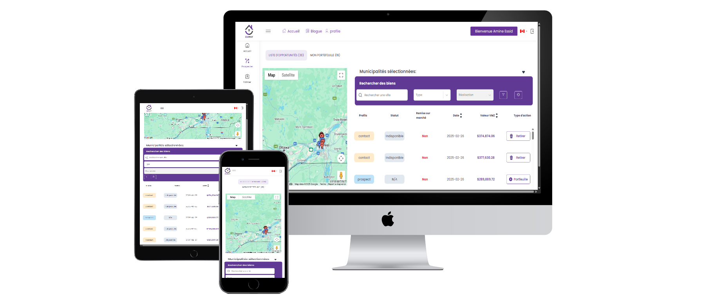
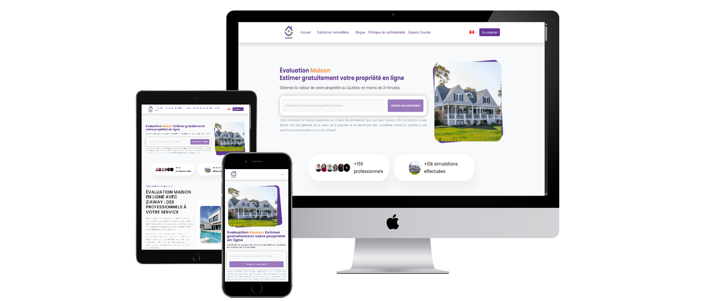

## Amine Essid
---

Full-Stack Developer (Javascript / Typescript).

I am a top rated plus Freelancer mainly on Upwork, building reliable Full-Stack products & solutions for business’s owners, entrepreneurs, managers, and visionaries worldwide. 
I have 5 years of experience in the software development field, and I have done it all:

Early-Stage Startup: From MVP to Market-Ready SaaS

   
<strong>Duration:</strong> February 2023 – May 2025 
<strong>Employment Type:</strong> Contract 
<strong>Role:</strong> Full Stack Developer (React, Firebase, Node.js) 
 

As a Full Stack Developer at Ziaway, a Canadian startup, I played a key role in rebuilding and launching the platform. 

While working with the Ziaway team, I led the revamp of two web applications:
- Ziaway.ca: An AI-powered platform that enables property value evaluation
- Pro-Ziaway: A subscription-based dashboard that provides real estate brokers with access to potential lead data. 

<strong>Key contributions:</strong> 

- Upgraded the codebase of both web applications from React 16 to React 18, migrating all related packages including Firebase (from namespaced API to modular API) and Redux (to Redux Toolkit). 
- Implemented a completely new and modern UI/UX, adding multiple features and pages. 
- Developed client and broker dashboards and integrated the applications with our custom machine learning model, enabling users to accurately estimate real estate property values using AI-powered tools 
- Integrated multiple third-party APIs and automations, including Stripe (subscription management), Google Maps, Meta, Twilio, and Zoho CRM (marketing campaign monitoring). 
- Maintained and developed multiple Node.js cloud functions to handle server-side tasks for Ziaway's web applications. 

 
 
 

